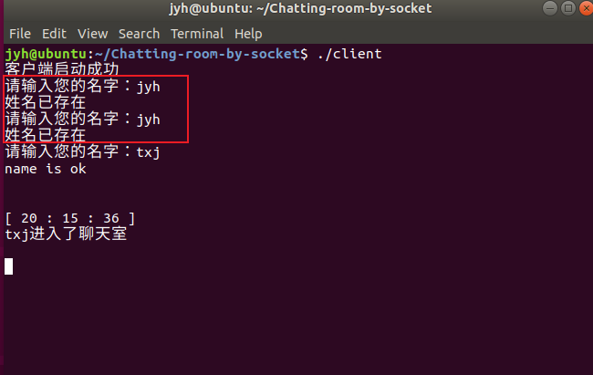
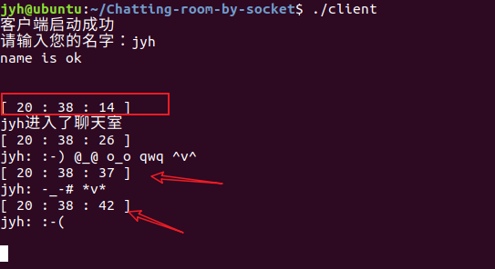
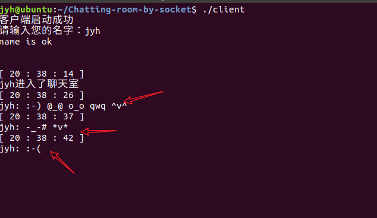
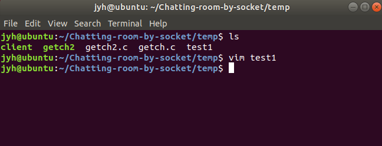
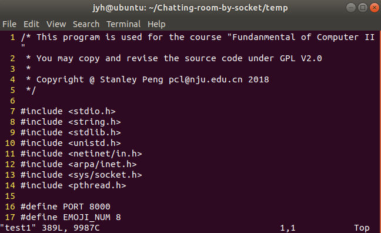
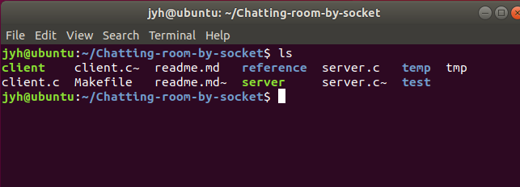
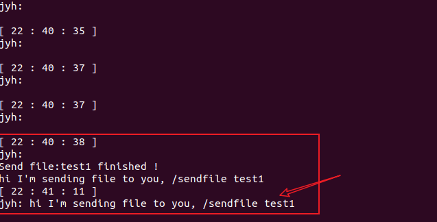
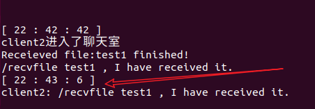
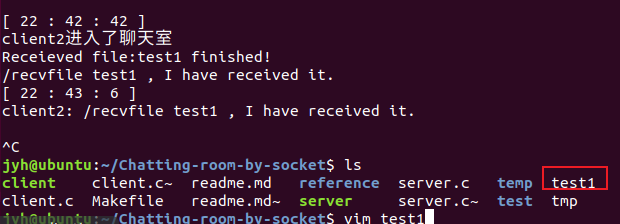
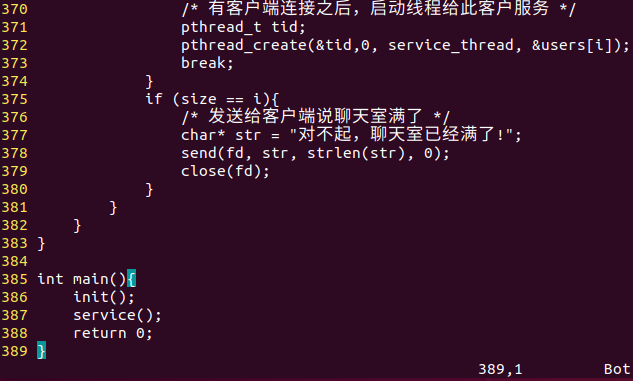

# 基于C语言Socket的聊天室

### 一、特色功能与使用方法

#### 1	显示实时聊天时间

自动显示


#### 2	支持表情

共支持如下 8 种表情：

`":-)","qwq","^v^",":-(","*v*","@_@","-_-#","o_o"`

聊天框中输入对应转义单词，即可显示表情

`"/smile","/cry","/happy","/sad","/like","/dizzy","/speechless","/dull"` 

注：转义单词前后以空格隔开


#### 3	支持文件传输

`\sendfile` + `文件名` ,   客户端发送文件到服务器端

`\recvfile` + `文件名`， 客户端从服务器端接收文件

注: `\recvfile` 与 文件名之间以空格隔开 


#### 4	支持私聊

`\prvtmsg NAME1,NAME2,... MSG`

发送消息到`NAME1`,`NAME2`,...

注：MSG也可放在前面，`\prvtmsg`前面要空格


### 二、问题改善

#### 1	聊天室姓名重复问题


#### 2	读取键盘信息后，清除键盘输入

键盘输入完信息后，利用代码：

```c
printf("\033[1A");
printf("\033[1A");
```

将终端光标向上移动两行，

用接下来的聊天信息，覆盖键盘读入信息


### 三、特色功能实现方式

#### 1	显示实时聊天时间


#### 2	支持表情


#### 3	支持文件传输

文件传输信息实际与聊天信息传输方法相同，

即发送端利用`fopen` 打开文件，将文件信息`send` 到接收端

接收端`recv` 到文件信息，再利用`fwrite`写入文件

**注**：

- 传输信息时，在文件信息首端加入`!#`, 以区别聊天信息，方便接收端处理。
- 传输信息时，`send`消息长度与`recv`消息长度保持一致，以解决粘包、漏包现象。
- 发送端文件信息传输完成后，发送`endfile`信息，表示文件传输完成，作为关闭文件指针的标识。


#### 4	支持私聊

格式：`(MESSAGE )/prvtmsg USERNAME1,USERNAME2... MESSAGE`

**注**：

* 私聊的消息会在时间戳之后附加`**private message**`标识
* 可以自己给自己发送私聊消息（此时发送消息的客户端中，私聊消息不会显示两次）

* 会识别用户名是否存在，若不存在会在发送消息的客户端显示不存在的客户名
* 服务器端会显示消息实际发送给了哪些用户，方便管理员核实
* 私发消息也支持表情功能


### 四、截图展示

#### 1	解决聊天姓名重复问题




#### 2	实时显示聊天时间



#### 3	支持表情




#### 4	支持文件传输

**client1** :



测试文件：`test1`




**client2**:



**server:**


- client1 发送文件到服务器



- client2 从服务器接收文件

  

- client2 查看接收的文件



`test1`:




#### 5	支持私发信息

