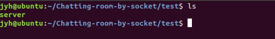

# 基于C语言Socket的聊天室

### 一、特色功能与使用方法

#### 1	显示实时聊天时间

自动显示


#### 2	支持表情

共支持如下 8 种表情：

`":-)","qwq","^v^",":-(","*v*","@_@","-_-#","o_o"`

聊天框中输入对应转义单词，即可显示表情

`"/smile","/cry","/happy","/sad","/like","/dizzy","/speechless","/dull"` 

注：转义单词前后以空格隔开


#### 3	支持文件传输

`\sendfile` + `文件名` ,   客户端发送文件到服务器端

`\recvfile` + `文件名`， 客户端从服务器端接收文件

注: `\recvfile` 与 文件名之间以空格隔开 


#### 4	支持私聊

格式：`(MESSAGE )/prvtmsg USERNAME1,USERNAME2... MESSAGE`

发送消息到`USERNAME1, USERNAME2`

**注**：

* 私聊的消息会在时间字符串之后附加`**private message**`标识
* `\prvtmsg`前可以加`MESSAGE`，但此时`\prvtmsg`前面必须有空格
* 可以自己给自己发送私聊消息（此时发送消息的客户端中，私聊消息不会显示两次）
* 会识别用户名是否存在，若不存在会在发送消息的客户端报错显示不存在的客户名（其他正确的用户名仍然会接收到私发消息）
* 服务器端会显示消息实际发送给了哪些用户，方便管理员核实
* 私发消息也支持表情功能


### 二、问题改善

#### 1	聊天室姓名重复问题


#### 2	读取键盘信息后，清除键盘输入

键盘输入完信息后，利用代码：

```c
printf("\033[1A");
printf("\033[1A");
```

将终端光标向上移动两行，

用接下来的聊天信息，覆盖键盘读入信息


### 三、特色功能实现方式

#### 1	显示实时聊天时间

服务器在发送任何消息之前会先发送一个时间字符串

调用C标准库头文件`<time.h>`，通过`time`函数获得当前时间戳，再通过`localtime`函数获取本地时区的`tm`结构体，最后通过tm结构体获取格式化后的时间字符串，在每次发送消息之前发送先发送时间字符串。


#### 2 支持表情


#### 3	支持文件传输

文件传输信息实际与聊天信息传输方法相同，

即发送端利用`fopen` 打开文件，将文件信息`send` 到接收端

接收端`recv` 到文件信息，再利用`fwrite`写入文件

**注**：

- 传输信息时，在文件信息首端加入`!#`, 以区别聊天信息，方便接收端处理。
- 传输信息时，`send`消息长度与`recv`消息长度保持一致，以解决粘包、漏包现象。
- 发送端文件信息传输完成后，发送`endfile`信息，表示文件传输完成，作为关闭文件指针的标识。


#### 4	支持私聊

先解析私聊命令，判断消息是否为私聊。若为私聊，则获取私发的对象的用户名，再根据用户名查找用户通信对应的文件描述符，向这些文件描述符发送修改了格式的私聊消息。


### 四、截图展示

#### 1	解决聊天姓名重复问题


#### 2	实时显示聊天时间


#### 3	支持表情


#### 4	支持文件传输

**client1** :


测试文件：`test1`


**client2**:


**server:**




- client1 发送文件到服务器


- client2 从服务器接收文件

  

- client2 查看接收的文件


`test1`:


#### 5	支持私发信息

首先我打开三个客户端，用户名分别为`Hugh`, `Tom`，`Mary`

* 私聊的消息会在时间字符串之后附加`**private message**`标识

* 可以自己给自己发送私聊消息（此时发送消息的客户端中，私聊消息不会显示两次）

* `\prvtmsg`前可以加`MESSAGE`，但此时`\prvtmsg`前面必须有空格

  例：Hugh私发给Tom

  Hugh输入，私发给Mary, Hugh:

  

  Hugh、Mary客户端都显示同样的信息，时间字符串后有`**private message`标识：

  

  

  Tom客户端没有这条消息：

  

  服务器端除了私发消息的内容外，还会显示消息的实际接收者：

  


* 会识别用户名是否存在，若不存在会在发送消息的客户端报错并显示不存在的客户名（其他正确的用户名仍然会接收到私发消息）

例：Hugh客户端私发给Mary和Frank，其中Frank用户不存在

Hugh客户端:


服务器端显示实际上只发送给了Mary：

